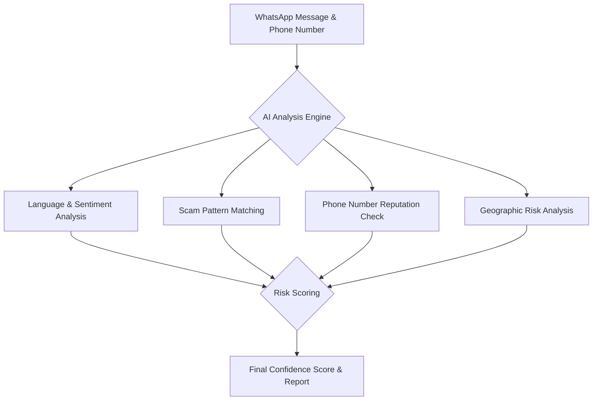

# 🏆 3MTT Knowledge Showcase: ScamBuster - Pitch Document

**Applicant:** ABUBAKAR YAHAYA BARAYA  
**Category:** Individual, AI-Powered Project

---

## 1. The Problem: A Digital Plague in Nigeria

Nigeria is facing a digital epidemic. Every day, thousands of citizens and small businesses fall victim to sophisticated WhatsApp scams. These aren't just spam messages; they are targeted attacks that lead to devastating financial losses, destroy trust, and cripple the growth of our digital economy. The problem is personal, it's widespread, and it demands a powerful, intelligent solution.

---

## 2. Our Solution: ScamBuster

**ScamBuster** is an AI-powered guardian built to protect the Nigerian people from WhatsApp scams. It is a web application that allows users to instantly analyze suspicious messages and phone numbers to get a clear, data-driven risk assessment *before* they engage.

**[▶️ Watch the 2-Minute Video Demo Here](https://your-video-link.com)** _(I highly recommend you record a short video and replace this link!)_

**[🚀 Access the Live Application Here](http://localhost:3000)**

---

## 3. How the AI Works: A Multi-Layered Defense

ScamBuster's intelligence comes from a sophisticated, multi-layered analysis engine. Instead of relying on a single factor, it combines several data points to generate a highly accurate confidence score.

---

## 4. Key Features

*   **Real-Time Scanning:** Instantly analyze messages and numbers.
*   **Secure Authentication:** User accounts are protected with JWT and password hashing.
*   **Insightful Dashboard:** Users can track their scan history and see community-reported scam trends.
*   **Community Reporting:** Users can report new scams, strengthening the platform for everyone.
*   **Developer Showcase:** A personalized section to highlight the developer's skills and journey.

---

## 5. Technology Stack

*   **Backend:** Node.js, Express.js
*   **Frontend:** HTML5, CSS3, JavaScript
*   **Security:** JSON Web Tokens (JWT), Bcrypt
*   **Data Storage:** JSON Files (for lightweight, portable data)
*   **Development:** Nodemon for live-reloading

---

## 6. Vision for the Future

ScamBuster is more than a project; it's a foundation. My vision is to expand it into a comprehensive security suite for Nigerians:
*   **Mobile App:** A native Android/iOS app for on-the-go scanning.
*   **Browser Extension:** To protect users from scams on websites and social media.
*   **Business API:** Allow e-commerce sites to integrate ScamBuster to verify sellers.

---

## 7. Why ScamBuster Deserves to Win

This project directly embodies the 3MTT mission: **to empower Nigerians with technology to solve real, pressing local problems.** ScamBuster is not a theoretical exercise; it is a practical tool built with passion, designed for impact, and ready to make a tangible difference in the lives of millions. By awarding ScamBuster, you are investing in a safer digital future for Nigeria.

Thank you for your consideration. 